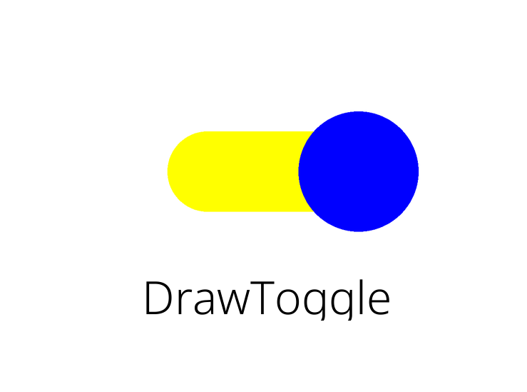

Customising
============

.. highlight:: python

inkBoard also allows adding custom elements and functions relatively easily.
Both can be parsed, in the appropriate places, using the ``custom:`` identifier.
This page is a small reference on writing your own custom elements and functions.
As a reference, these files are included in the `example configuration <https://github.com/Slalamander/inkBoarddesigner/tree/main/examples>`_ in the designer repo.
For this part of the tutorial, some experience with coding in Python can be useful to fully understand what is going on.

Custom Functions
-----------------

To get started, in the folder where your configuration file is located, navigate to ``custom/functions``.
You can create these folder if they do not exist yet.
In the functions folder, create a new file ``custom_functions.py``.

Lets start with importing the necessary modules.
From ``inkBoard.elements``, the elements that will be used within functions are imported.
From ``inkBoard.decorators``, the ``elementactionwrapper`` is imported.
This is a decorator that can be used to easily allow functions to be used as element actions, without requiring the parameters that are usually passed.

In line 8, the inkBoard ``CORE`` object is imported. This object holds all objects of the current running configuration, like ``CORE.screen``, ``CORE.device`` and ``CORE.config``.
Type hinting is in place, so getting information on the objects attached to it is relatively straight forward with an IDE.

Lastly, under ``TYPE_CHECKING``, a few modules are *"imported"* for type hinting.
This generally makes it a bit easier to code functions, since it makes it easier for an IDE to show what properties, functions and the like are available for an object.
Keep in mind that imports under ``TYPE_CHECKING`` must be wrapped in quotation marks when referencing them.

.. literalinclude:: /_static/custom_functions.py
    :caption: Importing inkBoard modules and required modules
    :linenos:
    :start-at: import
    :end-before: def
    :emphasize-lines: 5,6, 8

.. note::
    Under the hood, inkBoard dashboards are made using the PythonScreenStackManager module. 
    This module is developed alongside inkBoard, but for simplicity inkBoard has equivalent modules that link to the appropriate PSSM module.
    Importing directly from PSSM should not be necessary for most basic custom functions and elements, however some references to the module may be made in the tutorial.

First off, make a function that will update a button to show the coordinates you tapped on.
The coordinates can be extracted from the :py:class:`InteractEvent <PythonScreenStackManager.pssm_types.InteractEvent>`.
Subsequently, call ``element.update`` to update the element that was tapped on.
The ``update`` function takes a dict under ``updateAttributes``, which indicates which properties to update to what value.
By giving it a ``text`` key, the element's ``text`` property will be updated to the new value.

.. literalinclude:: /_static/custom_functions.py
    :caption: A custom function to show tap coordinates
    :linenos:
    :start-at: def
    :end-at: element.update

.. tip::
    Custom functions can also be async (preferably so, even). The screen takes care that functions do not block the event loop.
    Some base functions, like ``update`` also have async equivalents, like ``async_update``.

To now assign the function to an element, we can set the ``tap_action`` of ``my-button`` to ``custom:my_function``.
When running the config, you will see that ``my-button`` now shows the coordinates when you tap it.

.. code-block:: yaml

      - type: Button
        id: my-button
        text: Hello World!
        font_color: white
        font_size: 0
        fit_text: true
        font: default-bold
        tap_action: custom:my_function

The ``elementactionwrapper`` may be useful if you want to use a certain function in multiple places, or for multiple purposes.
It catches out the element and interactevent from the function call, and subsequently calls the function with everything else.
For now, a simple function that prints the network the device is currently connected to will suffice.
The network can be accessed from the ``CORE`` object, via the ``device`` attribute.
Be aware that accessing the network is only available on devices that have that feature.

.. literalinclude:: /_static/custom_functions.py
    :caption: Using an ``elementactionwrapper``
    :linenos:
    :start-at: @element
    :end-at: print("The device

Assigning it to an element can be used in the same way as ``my_function``.

.. important::
    Custom functions can be defined in python files and modules in the ``custom/functions`` folder.
    inkBoard collects all functions from all files, as well as functions in the ``__init__.py`` file in modules.
    Custom functions can be used by calling them via the identifier ``custom:``

Custom Elements
-----------------

To use custom elements, a similar approach is taken as for custom functions.
In your config directory, create the folder ``custom/elements``.
In there, create the file ``custom_elements.py``.

Making custom elements is a bit less straightforward than a custom function.
All elements in inkBoard are directly based on images, meaning the screen expects an instance of Pillow's ``Image.Image``.

Custom Layout
~~~~~~~~~~~~~~~~~~~~~~~~

A better starting point may be to create a custom ``Layout`` based element, since that means you can use all the base elements provided.
For this, the ``LabeledElements`` from the tutorial will be recreated.
This element is based on the ``GridLayout``, but additionally puts a label under each element to show the name of it.

Start off with importing the type of element the custom element will be based on.
For the ``LabeledElements``, that is a ``GridLayout``.

.. code-block:: python

    from inkBoard.elements import GridLayout, Layout, Element, Button

The element itself should be able to be interchangable with a ``GridLayout``, so no new properties or arguments will be introduced.
The ``GridLayout`` expects a list of elements to put into the grid. 
This is all that will need to be changed, for which the ``__init__`` method will need to be overwritten. Hence, start by defining your own.

Instead of the elements provided in the configuration, the elements should be the element from the configuration plus a label.
That will be done using the ``create_element_label`` function, which will be defined later.
What is will do is get an element, and return another one that is the labeled version.
The ``create_element_label`` is called for each element from the config, which is passed via the ``elements`` argument.
Every labeled element is subsequently put into its own list, and that list is the one that will be passed to the ``GridLayout``.

.. literalinclude:: /_static/custom_elements.py
    :caption: Creating a ``LabeledElements`` in ``custom_elements.py``
    :linenos:
    :start-at: class LabeledElements
    :end-at: super().

To create the label, you will need to determine a few things.

- What element will display the label?
- How will the element and the label be combined
- What properties of the original element need to be copied?

The first one is relatively straightforward. ``Button`` elements display text.
For the second question, well, a ``Layout`` element can be used to create a layout with the two elements.
The third question is less easy to answer, and also depends on your own wishes.
Obviously, the name of the element needs to be retrieved, in order to display it on the label.
It may be useful to copy the ``tap_action`` as well, such that label can be pressed too, with the same result.
Since elements in a ``GridLayout`` can be directly assigned to a cell, those attributes should be copied to the label element as well.
With this in mind, the function can be written as follows:

.. literalinclude:: /_static/custom_elements.py
    :caption: Creating labels for elements
    :linenos:
    :start-at: def create_element
    :end-at: grid_row=

Line by line, the following steps are taken:

- ``line 1``  The function is defined. It only needs an element as parameter, which will be wrapped in a label.
- ``line 2``  Gather the name for label. If the element has the property ``label_text``, that property will be used for the label. Otherwise, the name of the element's class will be used.
- ``line 4``  Create the ``Button`` element that will function as the label. The properties can be set just like you would do in YAML. Check for a ``label_tap_action`` property in case a custom tap action is desired.
- ``line 6``  Use the element's id for the labeled container's id. Makes it easy to reference it if needed.
- ``line 7``  Create the layout matrix for the label container. A layout matrix is made up a list containing more lists. Each subsequent list is a row in the layout. The first entry denotes the rows height, every subsequent entry must be a tuple with an element and a dimension to denote its width.
  Hence, this layout has two rows. The top row contains the element itself, the bottom row contains the label.
- ``line 8 & 9``  Create the ``Layout`` element and return in. Pass all the required parameters, and optionally copy the element's ``grid_row`` and ``grid_column``.

Now, the element can be used as a layout in YAML as follows:

.. code-block:: yaml

    - type: custom:LabeledElements
      elements:
        - type: Button
          text: Hello World!
          fit_text: true
          radius: h*0.1
          background_color: inkBoard-light
        - type: Icon
          icon: mdi:shape
          background_shape: circle
          background_color: inkBoard-light

.. dropdown:: The full LabeledElements class

    .. literalinclude:: /_static/custom_elements.py
       :caption: Creating labels for elements
       :linenos:
       :start-at: class LabeledElements
       :end-at: grid_row=getattr(element

From Scratch
~~~~~~~~~~~~~~~~~~~~~~~~

The labeling all pretty convenient, but it doesn't really do anything you couldn't do in YAML by hand.
To get a better grasp for designing elements, lets create one from scratch.
This element will function as a toggle, meaning it will switch between an ``on`` and ``off`` state when tapped on.
First, import the modules, decorators, classes and types that will be needed.

.. literalinclude:: /_static/custom_elements.py
    :caption: Imports for ``DrawToggle``
    :linenos:
    :start-at: from PIL
    :end-at: DrawShapes

A toggle element actually already exists, the :py:class:`Toggle <PythonScreenStackManager.elements.Toggle>` element.
However, that one is based on the ``Icon`` class.
To create one from scratch, it will be based on the base ``Element`` element.
This class, as stated in the documentation, will throw an error when used as is.
To make an element functional, it will need a ``generator`` method. This method generates the image file that displays the element.
More on that later. First the class itself will need to be defined. To do so, you should determine a few things.

- What will the element be named?
- How many colors will it have and which properties will be connected to them?
- Should the element have specific element actions?
- How will the element display its current state?

To start, name the element class ``DrawToggle``. Since it will look like a toggle switch, say it will have three colors. 

- A ``handle_color``, which will be the color of the circle handle
- An ``on_color``, which will be the color of the toggle slider when it is ``on``.
- An ``off_color``, which is the color of the toggle slider when it is ``off``.

Since this element will be a toggle, it makes sense for it to have an element action to do so.
And there will need to be a variable to keep track of whether it is ``on`` or ``off``.
With that determined, it is time to start setting up the element.

.. literalinclude:: /_static/custom_elements.py
    :caption: Imports for ``DrawToggle``
    :linenos:
    :start-at: DrawToggle
    :end-at: __toggleState = True

In the setup, ``shorthand_actions`` is used to tell inkBoard what string actions this element has, and to what methods they map.
Furthermore, the ``__init__`` method of the base ``Element`` is called, which takes care of defining all the required internal variables that handle the logic.
This is **required** for any element. At which moment it happens does not matter, so long as it is actually called.
By using the ``**kwargs`` in ``DrawToggle.__init__`` and subsequently passing it to ``Element.__init__``,
all default properties like ``id``, ``background_color`` and the like can be defined in the config and set by the element without the need to repeat the arguments ad nauseam.
Afterwards, the values passed in the config of the element are set to their respective color property.
``__toggleState`` will be used to track the state internally, with ``True`` meaning it is ``on``, and ``False`` meaning it is ``off``.

Now it is time to define the properties of the element. inkBoard itself generally uses the following conventions when naming properties:

- ``snake_case`` for properties that can be set
- ``camelCase`` for properties that should not be directly set

Following this convention, ``toggleState`` will be ``camelCase``, since it should only be changed by calling the ``toggle`` function.
The color properties, however, can be ``snake_case``.

.. literalinclude:: /_static/custom_elements.py
    :caption: properties for ``DrawToggle``
    :linenos:
    :start-at: @property
    :end-at: self._off_color

Note the decorator used for the color properties, :py:obj:`@colorproperty <PythonScreenStackManager.pssm.util.colorproperty>`.
This decorator takes care of applying a setter function automatically, if none is defined.
This function takes care of validating if a color is valid, and assigns the value to the appropriate attribute.
Hence when defining a colorproperty, always return the attribute via the convention ``def my_color -> return self._my_color``.
The ``handle_color`` is given the ``NOT_NONE`` variant of the property, which indicates the value cannot be ``None`` (meanign no color).
Keep in mind, the string value ``"None"`` will automatically convert to ``None`` in colors.

To make the element toggleable when clicked on, the methods to toggle the element have to be defined,
and interactions with it need to be caught.

.. literalinclude:: /_static/custom_elements.py
    :caption: Setting up functionality for toggling
    :linenos:
    :start-at: def toggle(self):
    :end-at: return self._tap_action

The two toggle functions are quite straightforward. ``self.__toggleState`` is simply set to the opposit value of what it is currently.
Since it is has a double leading underscore, the variable cannot be accessed by other classes than the ``DrawToggle``.
Since the ``update`` methods are defined in ``Element``, it cannot be passed via ``updateAttributes``.
So, the new value is set in the toggle methods, and subsequently the ``update`` method is called with ``updated=True``.
This signals to the method that the element was updated before calling the update function, and will force it to generate its image again.
Although the class has both ``toggle`` and ``async_toggle`` defined, it is not quite required to use async functions.
They can be complicated even if you know what you are doing.
But it makes resource management generally better, so long as you do not block the event loop by calling blocking functions like ``time.sleep`` or ``Image.open``.

Anyhow, the last part of toggling is actually triggering the toggle when interacting with the element.
For this, the elements ``tap_action`` property will have to be redefined.
Like color properties, element actions also have a convenience decorator, :py:obj:`@elementaction <PythonScreenStackManager.pssm.util.elementaction>`.
This again will take care of applying a default setter, that will process element action dicts as explained before, and validate if a string function actually exists.
In this case, only the property getter is overwritten, and not in any complicated way.
It simply calls ``self.toggle()`` when the ``tap_action`` is requested, which (should) only be done when interacting with it.

That basically implements the full functionality for a toggle. But when you add the element to your config, it will throw an error.
It is still missing its ``generator`` method, which is the method that actually draws the element, so it is rather important.
Lets set one up.

.. literalinclude:: /_static/custom_elements.py
    :caption: Starting a generator method
    :linenos:
    :start-at: def generator(
    :end-at: [(x,y),(w,h)] =

A usual starting point for an element is to check if it is passed an area.
The ``self._area`` attribute is actually also set by parent layouts, however defining it in code can also allow users to generate the element without starting up a full inkBoard session.
Now, the size of the element has to be gotten from the area, which is a :py:class:`PSSMarea <PythonScreenStackManager.pssm_types.PSSMarea>`.
The width and height are in the latter tuple.

.. literalinclude:: /_static/custom_elements.py
    :caption: Setting up a background image
    :linenos:
    :start-at: background_color =
    :end-at: (slider_h, slider_w) =

With that, the base image can be set up. Since inkBoard allows defining custom color shorthands, calling ``Style.get_color`` is required.
This function takes care of converting any kind of valid color value into an appropriate representation for the kind of image.
The mode of the image may need to be kept in mind. It will generally be ``"RGBA"``, but in case it changes how an element functions, you may need to check for this.
The appropriate image mode can be gotten from the ``screen`` instance, which is an attribute that every element has.
With that, ``Image.new`` is called to create the base image with the appropriate ``background_color``.

.. literalinclude:: /_static/custom_elements.py
    :caption: Setting up functionality for toggling
    :linenos:
    :start-at: if self.toggleState:
    :end-at: DrawShapes.draw_rounded_rectangle

To get started with drawing the toggle itself, first the appropriate color for the slide part should be determined, base on the toggle state.
The slider should not take up all available space. In the example, the values are hardcoded to be 40% of the available height and 50% of the available width.
To convert these values to values that can be used by Pillow, call ``self._convert_dimension``.
This converts dimensional strings into the correct pixel values for the element.
With those values, the coordinates of the slider can be calculated.
Pillow expects a bounding rectangle for drawing rectangles.
To determine these, first determine the center coordinates of the image.
Then, using the previously calculated width and height, setup the corner coordinates.
The upper left corner is the center x coordinate minus half the slider width and the center y coordinate minus half the slider height.
The lower right corner follows the same convention, but instead adds to the center coordinates.
With that done, call ``DrawShapes.draw_rounded_rectangle``.
The ``DrawShapes`` library is a tool for inkBoard that takes care of drawing shapes in decent resolution, since drawing with ``ImageDraw`` does not always yield nice results.
The library simply implements some minor anti aliasing.

.. note::
    When programming with images, the usual convention is having the origin (0,0) located in the upper left.

.. literalinclude:: /_static/custom_elements.py
    :caption: Setting up functionality for toggling
    :linenos:
    :start-after: DrawShapes.draw_rounded_rectangle
    :end-at: return base_img

What is left is drawing the handle in the correct place.
When it is ``on``, the handle should be on the right, and when it is ``off``, it should be on the left.
Again, first calculate the correct coordinates. Currently the ``draw_circle`` method is somewhat outdated, and does not accept center coordinates for a circle.
Hence, a bounding rectangle has to be calculated again, ``circle_xy``.
The x coordinate is simply the left or right coordinate of the slider.
That means the bounding box can be calculated from the image's center height and ``circle_x`` using the radius ``circle_r``, which is set to be 75% of the slider's height.
This means the full circle will be 150% of the height of the slider.
The color is gotten from ``self.handle_color``, and from there call ``DrawShapes.draw_circle``.
Finally, return the ``base_image``. The ``DrawShapes`` functions have drawn all the shapes on the base image, so it can be returned as is.

That's it! The element can now by used by specifying ``type: custom:DrawToggle``.

.. dropdown:: The full DrawToggle class

    .. literalinclude:: /_static/custom_elements.py
       :caption: Creating labels for elements
       :linenos:
       :start-at: class DrawToggle
       :end-at: return base_img

The Result
-----------

With that done, combine it all in your ``tutorial.yaml``. Add a ``LabeledElements`` with a ``DrawToggle`` inside an give it a custom ``tap_action``.
Ensure the layout is added to the ``main_tabs``, run the config and open the appropriate tab.

.. code-block:: yaml

  - type: custom:LabeledElements
    id: my-custom-elements
    rows: 1
    columns: 1
    outer_margins: 100
    elements:
      - type: custom:DrawToggle
        tap_action: custom:my_print_function

This is the resulting labeled ``DrawToggle``:

