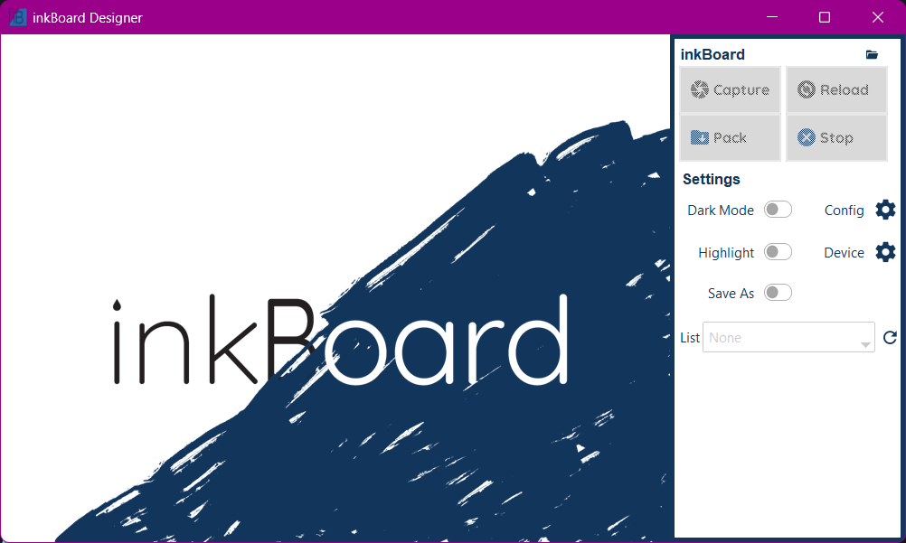
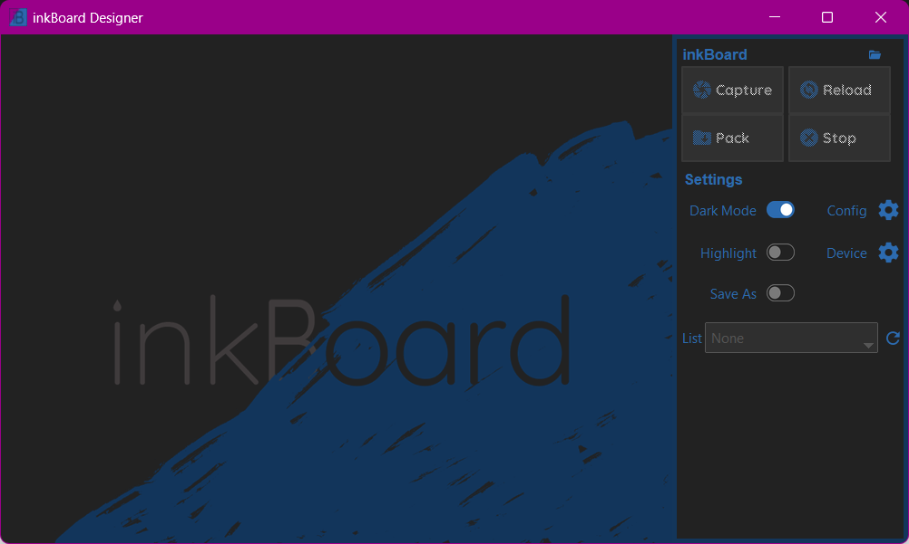
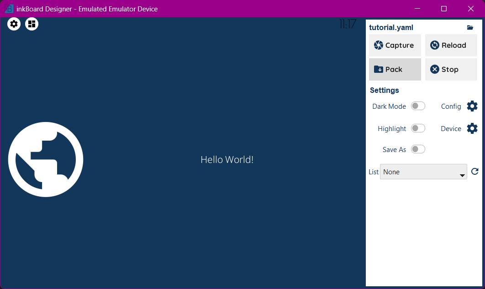
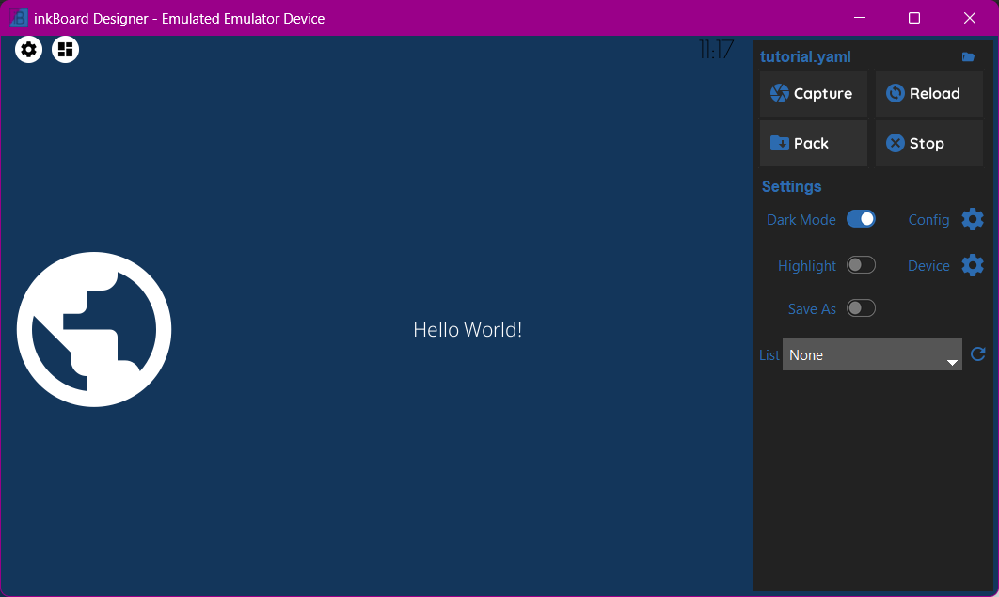

:description: Learn how to design elements and dashboards in inkBoard

Designing
=========

With a :ref:`base configuration <tutorial-configuration>` written, it is time to actually utilise it as a dashboard.
More elements will be added, interactivity will be configured as well, and styling options will be explained.
First, a basic workflow for designing a dashboard will be gone through, after which those complexer features will be explained.

But first, start inkBoard designer by running this command. You should be greeted by the opening screen.

.. code-block:: console

    inkBoard designer

.. tip::
   
   You can open a configuration file immediately by running

   .. code-block:: console

      inkBoard designer path/to/configuration/file.yaml

The top four buttons are currently disabled, since there is no configuration selected.
You can toggle around the settings if you want though, although for now only the Dark Mode toggle will do something. 
Lets load the configuration from the previous section. Press the folder icon in the top right and open ``tutorial.yaml``.
If the configuration was setup correctly, you should see the dashboard below.

That is not very impressive yet, of course. Lets start with fixing up the current elements. Then, implement some interaction, and start adding more complex elements.

Design Workflow
----------------

inkBoard, and especially the designer, tries to make iterating over dashboard designs as smooth as possible. You may have already noticed the `Reload` button in the top right. It does exactly what you think, namely reloading the configuration.
Lets make some changes to the dashboard, and put it to use.

Styling a Button
~~~~~~~~~~~~~~~~

Start by making the ``Button`` a little more readable. Increase the font size by setting ``font_size`` and make the text bold by setting ``font``.

.. code-block::
  :caption: applying a custom font size to ``my-button``

  - type: Button
    id: my-button
    text: Hello World!
    font_color: white
    font_size: h
    font: default-bold

.. important::

   Like colors, fonts have shorthands available too. The base shorthand fonts are ``default``, ``default-regular``, ``default-bold``, ``header`` and ``clock``. Mainly, they map to some of the fonts integrated in the package.
   ``quicksand``, ``notosans`` and ``merriweather``. Integrations can add more shorthands too.
   A set of shorthand icons is available too, but they all map to mdi icons by default. The Home Assistant integration, for example, adds the ``homeassistant`` shorthand, which maps to the home assistant logo icon.

Press the reload button (Or F5 as a keyboard shortcut) to reload the config. As you'll see, maybe setting the font size to the full available height was a little much.
Instead, lets use the maximum possible font size for which the text will still fit. For that, use the ``fit_text`` key. When that is ``true``, the element will use the value of ``font_size`` as the minimum allowed font size. So, by setting it to 0, it can basically just fit the text to whatever value is necessary.
Reload the configuration, and indeed, it looks a lot better.

.. code-block:: 
  :caption: ``my-button`` with automatic font size
  
  - type: Button
    id: my-button
    text: Hello World!
    font_color: white
    font_size: 0
    fit_text: true
    font: default-bold

Styling an Icon
~~~~~~~~~~~~~~~

``my-icon`` and ``my-button`` are both still somewhat floating about on the dashboard. To seperate them a bit more, give ``my-icon`` its own background color.
This can be done by applying ``background_color``. If only the ``background_color`` property is set, the entire space of the element will be filled with said color.
In this case, that is a bit much, so to limit the background space, ``Icon`` elements can be given a ``background_shape`` property. A circle matches quite well with the round globe.

.. code-block::
  :caption: Applying a background to ``my-icon``

  - type: Icon
    id: my-icon
    icon: mdi:earth
    icon_color: white
    background_color: inkboard-light
    background_shape: circle

.. important::
   
   Not every element allows the use of ``background_shape`` (yet). For ``Button`` elements and base ``Layout`` elements, the radius property does allow using rounded corners.
   The advantage of them is that not the entire element's background is usually filled, but instead they use the space required to encompass the visible parts of the element.
   Currently, the following values for ``background_shape`` are implemented:
   
   - ``circle`` (``ImageDraw.pieslice``)
   - ``square`` (``ImageDraw.rectangle``)
   - ``rounded_square`` (``ImageDraw.rounded_rectangle``)
   - ``rounded_rectangle`` (``ImageDraw.rounded_rectangle``)
   - ``octagon`` (``ImageDraw.regular_polygon``)
   - ``hexagon`` (``ImageDraw.regular_polygon``)
   - ``none``, meaning background shape
   - ``ADVANCED``, allows for complicated usage
  
   By setting the ``shape_settings`` property, you can further configure how the shape is drawn.
   Every shape (except ``ADVANCED``) has default settings, but those can also be overwritten. 
   See the appropriate function in `Pillow's ImageDraw Module <https://pillow.readthedocs.io/en/stable/reference/ImageDraw.html>`_. When using ``ADVANCED``, supply the ``method`` argument to ``shape_settings``, which has to be the string value of one of the methods of ``ImageDraw``.

Styling the StatusBar
~~~~~~~~~~~~~~~~~~~~~~

All that is left is to make the statusbar match the dashboard some more. First off, apply a bit of a margin on the top of it, such that the icons have a little more free space.
To keep the icons roughly the same size, increase its size too. By default, the statusbar gets 5% of the available space. Increase it to 7.5%.

.. code-block:: yaml
   :caption: Applying size and margins to the statusbar

   statusbar:
    outer_margins: [5, 10]
    size: "?*0.075"

To make the icons in the statusbar match ``my-icon``, the ``status_element_properties`` property can be used. This property applies the set properties to all the icons in the statusbar.
By setting the statusbar's ``foreground_color``, it is possible to use this value in child elements. By setting it to white, and subsequently setting ``icon_color`` to ``foreground``, the parent's ``foreground_color`` is used for the color value.
The same concept is used to set the ``background_color`` to the ``accent_color`` of the statusbar.

.. code-block:: yaml
   :caption: Editing the look of the status elements

   statusbar:
    outer_margins: [5, 10]
    size: "?*0.075"
    foreground_color: white
    accent_color: inkboard-light
    status_element_properties:
      icon_color: foreground
      background_color: accent
      background_shape: circle

.. important::

   Elements within layouts have access to the color properties of their parent layout. For example, an icon can take on its parent layout's ``background_color`` by setting ``icon_color`` to ``background``.
   Any color property of a layout is available as a shorthand as the name of that property minus the ``_color`` part. See the documentation for a specific element to see which color properties are available.

Finally, to make the clock's style match that of ``my-button``, a similar property will be used. Via ``element_properties``, certain layout type elements allow for styling elements within them.
This is mainly meant for layout elements with specific usage, like the ``Counter``, so more explanation to how they work will come later.
For now, the ``font_color`` is set to ``foreground`` as well, and the same font as ``my-button`` will be used.

.. code-block:: yaml
   :caption: Editing the look of the statusbar clock

   statusbar:
    outer_margins: [5, 10]
    size: "?*0.075"
    foreground_color: white
    accent_color: inkboard-light
    status_element_properties:
      icon_color: foreground
      background_color: accent
      background_shape: circle
    element_properties:
      clock:
        font_color: foreground
        font: default-bold

Continueing the Workflow
~~~~~~~~~~~~~~~~~~~~~~~~~~~~

Once you get the hang of styling elements, all those reloads and intermediate steps won't become as necessary. inkBoard tries to make its logs as usable as possible, especially for configuration errors, so if things don't work, keep an eye on that.
The dashboard resulting from all the steps in the previous section can be seen in the dropdown below.

.. dropdown::
   Resulting Dashboards

   .. carousel::
      :data-bs-interval: false

      .. figure:: images/tutorial-font-size-bad.png

         ..

         The font is a bit oversized

      .. figure:: images/tutorial-font-size-good.png

         ..

         ``fit_text`` fixes that

      .. figure:: images/tutorial-background-bad.png

         ..

         Fully applying a background color may be overdoing it somewhat

      .. figure:: images/tutorial-backgroundshape-good.png

         ..

         A ``background_shape`` looks more in place

      .. figure:: images/tutorial-statusbar-sizing.png

         ..

         A bit more space for the statusbar

      .. figure:: images/tutorial-styling-statuselements.png

         ..

         Styling the status elements

      .. figure:: images/tutorial-styling-clock.png

         ..

         Styling the statusbar clock

..

Designing a Dashboard
----------------------

Styling isn't all inkBoard can do. Nor are ``Icon`` and ``Button`` the only two available elements (as a matter of fact, a ``DigitalClock`` element has been styled too).
But to get a better feel for the more complex features, the dashboard needs more elements, those elements need to be configured, and stuff needs to actually work.

Element Actions
~~~~~~~~~~~~~~~~

Although inkBoard dashboards work fine with just displaying data, they are generally meant to be interactive.
By default, a couple of functions are available through the YAML syntax, which are referred to as `shorthand_functions`.
A few default ones are added, like ``quit`` and ``reload``, as well as some that depend on whether a platform supports certain features. For example, if a device supports the backlight feature, shorthands like ``backlight-toggle`` are also available.

Adding a shorthand to an element is quite simple. 
For example, adding ``reload`` to ``my-icon`` to reload the config on press is done by setting ``tap_action`` to ``reload``.
To add feedback on interaction, set ``show_feedback`` to ``true``.

.. code-block:: yaml
  :caption: Adding a ``tap_action`` to ``my-icon``

  - type: Icon
    id: my-icon
    icon: mdi:earth
    icon_color: white
    background_color: inkboard-light
    background_shape: circle
    show_feedback: true
    tap_action: reload

If you clicked around in the dashboard before, you may have noticed that the icons in the statusbar already are interactive, and open a menu when tapped on.
To explain how to mimick that behaviour, first add the ``popups`` entry, and make a ``PopupMenu`` element, which inherts from the base ``Popup`` element.

.. code-block:: yaml
   :caption: Making a ``Popup`` element

   popups:
      - type: PopupMenu
        id: my-popup
        title: "Hello World!"
        menu_layout:
          type: GridLayout
          elements:
            - type: Button
              text: Again!
              id: my-popup-button

.. important::
   
   ``Popup`` elements are simply ``Layout`` elements with added functionality to print them on top of whatever is currently on screen, and determine their size and position more directly.

This is a very simple element, but if you reload the dashboard, it does not appear. To make that happen, it has to be shown somehow.
To do so, the ``show`` shorthand function of ``my-popup`` can be linked to the ``tap_action`` of ``my-icon``. 
For this, the shorthand function identifier ``element:`` needs to be used, and the appropriate ``element_id`` needs to be set for the ``tap_action``.

.. code-block:: yaml
  :caption: Linking an element action to the ``tap_action`` of ``my-icon``

  - type: Icon
    id: my-icon
    icon: mdi:earth
    icon_color: white
    background_color: inkboard-light
    background_shape: circle
    show_feedback: true
    tap_action:
      action: element:show-popup
      element_id: my-popup

When tapping ``my-icon`` now, ``my-popup`` appears! The syntax for ``elementactions`` is the same for interaction actions, for example ``tap_action`` and ``hold_action``,
but ``elementactions`` can also be used with certain elements to automate them. In general, this goes for element properties starting with ``on_``.
To show this off, add a ``Counter`` and a ``Slider`` element to your dashboard. Don't forget to update ``my-layout`` and add them.

.. code-block:: yaml
  :caption: Creating a ``Slider`` and a ``Counter``

  - type: Counter
    id: my-counter
    minimum: -10
    maximum: 10
    foreground_color: foreground
    on_count:
      action: element:set-position
      element_id: my-slider

  - type: Slider
    id: my-slider
    minimum: -10
    maximum: 10
    color: accent
    thumb_color: foreground
    on_position_set:
      action: element:set-value
      element_id: my-counter

.. hint::
  .. dropdown::
    ``my-slider`` and ``my-counter`` do not show up

    .. code-block:: yaml
      :caption: edit ``my-layout`` to add the new elements

      - type: GridLayout
        foreground_color: white
        accent_color: inkboard-light
        rows: 2
        columns: 2
        column_sizes: [w/4, "?"]
        id: my-layout
        elements:
          - my-icon
          - my-button
          - my-counter
          - my-slider

When changing the value of ``my-counter``, ``my-slider`` updates to reflect that value too, and the same happens vice-versa.
``element_actions`` are more powerful than just calling some functions, however. Using the ``data`` and ``map`` keys, it possible to pass parameters to the called functions.
To do so, update ``my-counter`` such that the text of ``my-button`` is changed whenever its value changes. This can be done via the ``data`` key, since the text is a value that does not change.
``my-slider`` will update the the text of ``my-button`` to the current slider position. Since this means a value is mapped to a property of the element, the ``map`` key is used. The ``position`` property of the slider is the current value of the slider, so the ``text`` key under ``map`` should have the value ``position``.

.. attention::
  If you pass any parameters that a function does not accept, an error will be thrown and the function will not be called.

.. code-block:: yaml
  :caption: Using the ``data`` and ``map`` key in an ``elementaction``

  - type: Counter
    id: my-counter
    minimum: -10
    maximum: 10
    foreground_color: foreground
    on_count:
      action: element:update
      element_id: my-button
      data:
        text: Count me in!

  - type: Slider
    id: my-slider
    minimum: -10
    maximum: 10
    color: accent
    thumb_color: foreground
    on_position_set:
      action: element:update
      element_id: my-button
      map:
        text: position

Interacting with the two elements should now change the text displayed on ``my-button``. The shorthand function ``element:update`` updates the element's properties to the values passed via ``data`` and ``map``, and is available for any element.
The previous example, that linked the values of ``my-counter`` and ``my-slider``, can also be achieved by using the ``element:update`` shorthand. If you want to experiment more with ``elementactions``, try getting that to work, for example.

For available ``elementactions``, take a look at the documentation for the elements. The same goes for available shorthand actions. 

.. important::

  ``elementactions`` can be defined to call a function or do something when they are interacted with. Certain elements also have actions that allow automation, for example when their value changes.
  Look for element properties that end on ``*_action`` for interactable actions, and properties that start with ``on_*`` for automation actions.

  The ``data`` key for an ``elementaction`` can be used to pass directly defined values to the called function. This always happens by passing the value as a keyword, so be careful to check if the called function accepts said keyword.
  ``map`` functions similar to ``data``. However, instead of passing a defined value, it maps the value of the key to the value of the matching property of the element.

.. dropdown::
   Resulting Dashboards

   .. carousel::
      :data-bs-interval: false

      .. figure:: images/tutorial-actions-popup.png

         ..

         Opening a popup via a ``tap_action``

      .. figure:: images/tutorial-actions-newelements.png

         ..

         Adding a ``Counter`` and ``Slider`` element

      .. figure:: images/tutorial-actions-counterdata.png

         ..

         Setting the text of ``my-button`` via a ``data`` key

      .. figure:: images/tutorial-actions-slidermap.png

         ..

         Setting the text of ``my-button`` via a ``map`` key
..

Tiles
~~~~~~~

A type of element that you will run into quite often is the `TileElement`. 
This is not a directly usable element, but rather one that others often inherit from. They can be recognised by having the property ``tile_layout``.
The purpose of a ``tile_layout`` is to allow having layout elements with predefined elements and functionality, whilst keeping the ability to easily customise the placements of their elements.
The ``Counter`` added in the previous section is an example of this.

To use a ``tile_layout``, first take note of the "tiles" present in the element. These are simply the smaller elements that form the ``tile_layout``.
For a ``Counter`` these are ``count``, which is the ``Button`` that displays the value, ``up``, the ``Icon`` used to increment the value, and ``down``, the ``Icon`` used to decrement the value.
Most default tiles also provide a few default layouts, which are shorthands for some predefined layouts. For ``Counter``, that is ``default``, the layout ``my-counter`` has been using, and ``horizontal``, which aligns the three elements in a single row.

For a ``Counter``, a ``tile_layout`` value of ``default`` is equivalent to the value ``"count,[up;down]"``. For horizontal, the equivalent layout string is ``"down,count,up"``. This may give you a hunch as to how these strings are parsed.
But as an example, say you want a ``vertical`` layout, which is the equivalent vertical version of the ``horizontal`` layout. For that, the layout string would be ``"up;count;down"``. The difference between the two layout strings is in the delimiter between the tiles. For ``horizontal``, a ``,`` has been used, whereas for ``vertical`` a ``;`` has been used.
So, to order tiles horizontally, seperate them by a ``,``, which puts them in the same layout row. To order them vertically, seperate them by a ``;``. 
The main power of the tile layout parser lies in the last seperator, however. That is ``[``, or technically, the combination of ``[`` and ``]``. Encompassing tiles within square brackets tells the parser to put them in a layout of their own.
This means it is possible to have a two elements stacked vertically in a single row with another element, like in the ``default`` layout.

So, say you want the count tile on top of both the ``Icon`` elements. To achieve that, a ``tile_layout`` like ``"count;[down,up]"`` can be used.
Using this value already parses the wanted layout, however the proportions of the tiles are not quite balanced. For this, the properties ``horizontal_sizes`` and ``vertical_sizes`` of a ``TileElement`` can be used.
These properties can allow either the horizontal size of an element or its vertical size to be set. Aside from the available tiles, the keys ``outer`` and ``inner`` can also be passed to set the outer and inner margins respectively.
To fix the propertios of ``my-counter`` a bit, apply a horizontal and vertical outer margin, and allow the ``count`` tile to take up 60% of the available vertical space. Do the latter by setting its ``vertical_sizes`` key to ``"?*1.5"``.
Any sublayout is given a height of ``"?"``, so the ratio of the elements can be set by making use of that. Using a dimensional string with ``h`` in it is also possible, however in that case you will need to take the margins into account.

.. note::
   Updating ``horizontal_sizes`` or ``vertical_sizes`` will only update the passed values. Previously set values will remain as they were.

.. note::
   Due to how layouts work internally, a vertical size can only be applied per row, so they are only used when a tile takes up its a full row.

.. code-block:: yaml
   :caption: applying a custom ``tile_layout`` and sizing to ``my-counter``

   - type: Counter
     id: my-counter
     tile_layout: count;[down,up]
     horizontal_sizes:
       outer: w*0.1
     vertical_sizes:
       count: "?*1.5"
       outer: h*0.15
     ...

Whilst it looks better now, the value of the counter is still too small. It does not have to do with the size of the elements, really, moreso there styling. 
The ``count`` tile, which is a ``Button`` element, simply still uses the default ``font_size``. To style it, the ``element_properties`` property can be used. In a way, you have already used this, when styling the statusbar clock. 
Although *a statusbar is not a TileElement* the syntax for ``element_properties`` is the same. To style the ``count`` tile, apply the desired properties to it via ``element_properties``.
To apply a different color to the ``up`` and ``down`` ``Icon`` tiles, follow the same process to set their respective ``icon_color``. This syntax works as even with nested ``TileElements``, so styling of individual tiles is generally always possible.
You may need to apply the ``accent_color`` to the counter as shown, to make it use the one from its parent layout.

.. code-block:: yaml
    :caption: changing the styling of tiles in ``my-counter``.

    - type: Counter
      id: my-counter
      accent_color: accent
      ...
      element_properties:
        count:
          font_size: 0
          fit_text: true
        down:
          icon_color: accent
        up:
          icon_color: accent
      ...

.. tip::
  The ``TileLayout`` element allows you to make a layout using the ``tile_layout`` parser. To do so, configure the elements within it via the ``elements`` key and set the ``tile_layout`` as desired.
  .. code-block::

    - type: TileLayout
      elements:
        element-1:
          type: Button
          ...
        element-2:
        ...
      tile_layout: ...

.. important:: 
  A ``TileElement`` allows creating a layout by setting the ``tile_layout`` property. Include the available tiles of an element, and create the ``tile_layout`` via the following rules:
   - Seperate them horizontally using a ``","``
   - Seperate them vertically using a ``";"``
   - Seperate multiple elements from another by enclosing them within square brackets (``"["`` and ``"]"``)
  
  To style elements withint a ``TileElement``, use the appropriate key for the tile you want to style, and set its properties from there.

.. dropdown::
   Resulting Dashboards

   .. carousel::
      :data-bs-interval: false

      .. figure:: images/tutorial-tile-verticallayout.png

         ..

         Stacking tiles vertically 

      .. figure:: images/tutorial-tile-compactsizing.png

         ..

         A custom ``tile_layout`` with appropriate sizing

      .. figure:: images/tutorial-tile-elementproperties.png

         ..

         Styling tiles using ``element_properties``
..

Main Tabs & StatusBar
~~~~~~~~~~~~~~~~~~~~~

In the previous chapter's section :ref:`config-main_tabs-statusbar` were introduces briefly. With the basic tools to design elements under your belt, these can be styled too.
The ``main_tabs`` is meant to quickly set up a basic interface that allows easy navigation between various dashboards. When setting it up, however, the navigation bar was hidden, and only one tab was included, so this was not very obvious.
In general, the idea is to include layouts by referencing them by their id, but for simplicity's sake a tab will be added that just shows the time.

.. code-block:: yaml
   :caption: Adding a new tab to the ``main_tabs``

   main_tabs:
     hide_navigation_bar: false
     foreground_color: white
     accent_color: inkboard-light
     tabs:
      - element: my-layout
        name: My Layout
        icon: mdi:clipboard-text
      - name: The Time
        icon: mdi:clock
        element:
          type: AnalogueClock
          minimum_resolution: 1000
          clock_fill_color: accent
          outline_color: foreground

On the bottom of the screen, there is now a bar which shows the tabs with name and icon. Clicking on **The Time** will switch the current view to that tab.
The ``TabPages`` element is a ``TileElement``, meaning it can be styled as such. There are a few convenience properties, like ``hide_navigation_bar`` and ``hide_page_handles``, which simply change the value of the ``hide`` property.
Available tiles are ``navigation``, ``handle-next``, ``handle-previous`` and ``tab``. The ``navigation`` tile is the bar on the bottom.
To increase its size, use the ``vertical_size`` property. Styling it is a little different, however. The tile itself is a ``GridLayout``, however the element is wrapped to also be an ``ElementSelect``.
This is a more advanced elements that allows for selecting other elements. For styling, it comes with two additional properties, ``active_properties`` and ``inactive_properties``, with respective color properties ``active_color`` and ``inactive_color``.
Styling for ``active_properties`` is applied to *all* elements that are selected, and ``inactive_properties`` is applied to *all* that are not selected. For the ``navigation`` tile, when a new tab is selected by clicking on it, the other tab is automatically deselected.
The two handle tiles are ``Icon`` elements that go to the previous or next page. Using the shorthand functions of the ``TabPages`` it also possible to automate showing a tab.
For the example, the ``NavigationTile`` elements are given a custom layout, and their coloring is changed. The elements will also be aligned to the right side of the bar.

.. code-block:: yaml
  :caption: Styling a navigation bar

  main_tabs:
    hide_navigation_bar: false
    foreground_color: white
    accent_color: inkboard-light
    apply_default_sizes: false
    vertical_sizes:
      navigation: h*0.08
    element_properties:
      navigation:
        active_color: accent
        outer_margins: [0, 0, 0, "w*0.6"]
        active_properties:
          element_properties:
            icon:
              icon_color: white
        inactive_properties:
          element_properties:
            icon:
              icon_color: inkboard-light
        option_properties:
          tile_layout: icon;line
          horizontal_sizes:
            outer: "?"
          vertical_sizes:
            icon: h*0.75
            inner: 5
     tabs:
      ...

.. tip::
  Setting the ``foreground_color`` and ``accent_color`` of the ``main_tabs`` also means the colors of ``my-layout`` can be set by referencing these colors.

The ``statusbar`` entry puts a ``StatusBar`` element on the same level as the main tabs, meaning it stays visible when switching tabs.
For the config entry, two additional options can be passed, ``size`` and ``location``. Both are more or less self explanatory. There are 4 options for the location, ``top``, ``bottom``, ``left`` and ``right``.
Size takes any valid dimension value, but by default it takes up 5% of the available space. Move if to the left side of the screen, and adjust the margins accordingly.
Styling a statusbar is done via the ``element_properties`` syntax. The ``clock`` has already been styled, but the icons can be styled as well. By default, two status elements are available: ``device`` and ``inkboard``.
The ``device`` icon is a special type, namely a ``DeviceIcon``. These can monitor and show the status of certain device features. A useful one may be to show the status of the network connection.

.. code-block:: yaml
  :caption: Additional styling of the statusbar

  statusbar:
    outer_margins: [10, 5]
    size: "?*0.075"
    location: left
    foreground_color: white
    accent_color: inkboard-light
    status_element_properties:
      icon_color: foreground
      background_color: accent
      background_shape: circle
    element_properties:
      clock:
        font_color: foreground
        font: default-bold
      device:
        icon_feature: network

.. important:: 
  Both ``main_tabs`` and ``statusbar`` entries act as a shorthand to setup the base layout of a dashboard.
  The ``navigation`` tile of a ``TabPages`` element is a selector element, and allows styling of its elements by applying ``active_properties`` and ``inactive_properties``.
  In case of ``navigation``, the internal tiles are ``NavigationTiles``, and thus allow styling via the tile syntax. Its tiles are ``name``, ``icon`` and ``line``. For ``TabPages``, the tiles are ``navigation``, ``handle-next``, ``handle-previous`` and ``tab``.
  A ``StatusBar`` is not a ``TileElement``, however it does allow styling via the ``element_properties`` syntax. Status icons are added to it via inkBoard itself or by integrations.

.. dropdown::
   Resulting Dashboards

   .. carousel::
      :data-bs-interval: false

      .. figure:: images/maintabs-newtab.png

         ..

         Adding a new tab

      .. figure:: images/maintabs-styling.png

         ..

         Styling the navigation bar

      .. figure:: images/statusbar-styling.png

         ..

         Styling the statusbar and editing the ``device`` icon
..

.. images: clock view without styling and sizing -> styling the navigation tiles -> moving the statusbar

.. what more to add to the designing part?
.. -> tile layouts are important -> also use it to update the statusbar icon? in the part about element properties [x]
.. adding more tabs (can be short though), just add a simple layout
.. MAYBE for later, since it needs testing: using the ElementSelect.
.. Using the designer interface to help.
.. Adding integrations -> enabling them and parsing elements.

.. 1. improve font_size
.. 2. fix clock font color
.. 3. Background + shape for the button and the icon.
.. 4. improve statusbar -> give statusbar some margin by default
.. 5. improve cog icon to wifi signal? to explain the element_properties -> may already be done within the clock.

.. don't forget to talk about the interface as well.
.. When done with the entire documentation, maybe make the element names :ref:`Layout` or something.