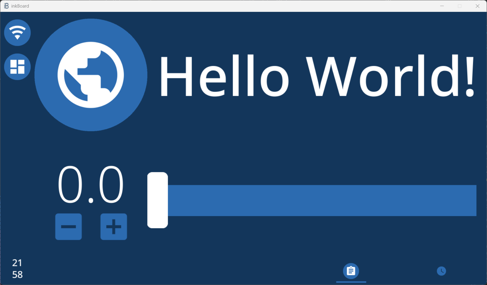

Packaging
==========

With a functional dashboard in place, it is time to ready ``tutorial.yaml`` to be deployed to a platform.
inkBoard supplies a (hopefully) convenient way to do this, by generating packages for the configuration file for the config's platform.
This is what the **Pack** button in the designer is for.

First off, the actual platform will need to be specified. Currently, the ``platform`` key under the ``device`` entry in the configuration is ``emulator``. 
This is value is meant as a placeholder, when you are simply designing a dashboard. It skips any validation checks for the device configuration as well.
For the tutorial, the :doc:`/platforms/desktop/index` platform will be used.

The advantage of this platform is that functions basically the same as the designer itself, but just omits the user interface on the right.
When running it on the same platform (and in the same environment) as the designer installation, it also has access to the same resources. Meaning integrations present in the designer do not need to be installed seperately.

As the programme grows, and more platforms are added, it is likely that the number of packaging methods will increase.

Installer Zip Package
-------------------------------
Currently, the Installer Zip Package is the only implemented package type. When you click the **Pack** button, you will be prompted to save a zip file. For now, save it as ``inkboard_tutorial.zip``.
inkBoard will create one with the supplied name, which contains a ``package.json`` file with information on the package (for example, inkBoard versions on which it was created).
This package contains the required yaml files from the base directory of the config, and the folders required for an inkBoard installation.

.. attention:: 
    It is not advised to install the zip package on the same machine as your designer installation.

    To run a configuration on there, run the install commands for platforms and integrations:

    .. code-block:: 
        
        inkBoard install platform desktop

    .. code-block:: 
        
        inkBoard install integrations <included integrations>
    
    |  
    |  In the future, this will be simplified to allow passing a configuration, such that only a single command will be needed.

Installing a package is quite easy. First, locate the ``readme.md`` file in the package, which should be in ``./configuration/readme.md``.
Keep this open while getting the package up and running, as it should explain how to get inkBoard up and running.
It can also be found in the documentation :doc:`here </platforms/desktop/readme-page>`.

In case of the ``desktop`` platform, the inkBoard installation process is relatively easy, but on platforms like ``kobo``, it takes a few steps to get inkBoard installed. 
Follow the instructions to install inkBoard on the platform, and then open a terminal in the folder where you want the configuration files to go.
Now copy the zipfile to this folder. Run the command below, and follow the prompts in the terminal to install all dependencies.

.. code-block:: console
    
    inkBoard install inkboard_tutorial.zip

.. tip::
    If you want to include additional files with the package, like scripts, you can put them in the ``files`` folder. All contents are copied to the zip archive.

Afterwards, the files and folder structure from the tutorial folder should appear. To start the dashboard, use the ``run`` command.

.. code-block:: console

    inkBoard run tutorial.yaml

And a screen similar to this one should open.

